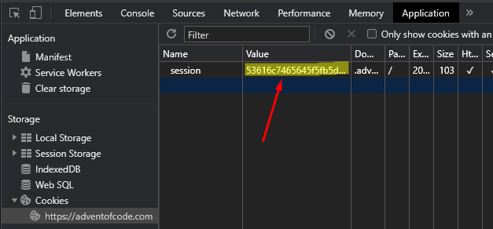

[](https://code.visualstudio.com/)


# AdventOfCode2020

My attempt at the Advent Of Code 2020 challenge.

## How to run:

1. Install Go: https://golang.org/
2. Install VSCode: https://code.visualstudio.com/
3. Open VSCode and install the recommended extensions.
4. Create a file called `cookie.txt` in the root folder of this repository.
5. Paste your session cookie into it to allow the code to download input sets automatically:
   
6. Open a command line and run the following:

   ```go
   go run cmd/main.go
   ```

7. ???
8. Profit!
